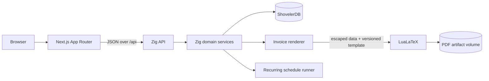

# Invoice Manager Planning Brief

Status: pre-mission planning input  
Prepared for: Spec Kitty `specify -> plan -> tasks`  
Project type: single-repository open-source application  
License decision: GPL-2.0-only  
Primary user: owner of a small technical consulting business

## 1. Purpose of this document

This brief captures the product intent, system boundaries, major decisions,
delivery sequence, and acceptance targets for a deliberately boring invoice
manager. It is source material for Spec Kitty missions; it is not a substitute
for a mission spec or the formal plan generated from an approved spec.

The first Spec Kitty mission should use this document to produce explicit
requirements, resolve the open decisions in section 17, and define a smaller
acceptance boundary before implementation begins.

## 2. Product statement

Build a dependable internal invoice manager for a technical consulting
business. The application should make routine billing fast and unsurprising,
while producing typographically excellent PDF invoices through LaTeX.

The product combines:

- client and billing-contact management;
- multiple issuer identities, including a personal identity and a company LLC;
- recurring project billing schedules;
- invoice drafting, preview, issuance, payment tracking, and PDF storage;
- per-client invoice-header selection;
- European versus domestic remittance-information rules;
- per-project logo policy;
- operational and revenue analytics.

The application is an internal business tool first. Its public repository,
documentation, sample data, and deployment story should nevertheless make it
usable by other independent consultants.

## 3. Product principles

1. **Boring is a feature.** Favor explicit state, familiar tables and forms,
   visible confirmation, and recoverable workflows over clever automation.
2. **Issued invoices are records.** Once issued, the commercial and visual
   contents of an invoice are immutable snapshots.
3. **Preview the consequential choice.** The issuer identity, bank details,
   logo, invoice number, currency, totals, and recipient must be visible before
   issuance.
4. **Money is exact.** Never use binary floating-point values for money.
5. **Automation proposes; the owner confirms.** Recurring schedules may create
   drafts, but the initial product does not automatically issue or send them.
6. **One source of business truth.** Next.js presents the system; Zig owns the
   business rules and persistence.
7. **Typography is part of correctness.** PDF layout regressions are tested as
   seriously as incorrect totals.

## 4. Goals

### 4.1 MVP goals

- Manage issuer identities, clients, projects, invoices, and payments.
- Require a default invoice header/billing identity for every client.
- Allow a project to override a client's default identity when a contract
  requires it, while making the override conspicuous.
- Include European bank information by policy and omit it from domestic
  invoices by policy.
- Enable or disable a logo for all invoices belonging to a project.
- Support monthly and quarterly project billing schedules.
- Show upcoming and overdue billing work.
- Render a polished, stable PDF through a versioned LaTeX template.
- Show invoiced, collected, outstanding, overdue, and forecast amounts.
- Keep currency totals separate when no explicit conversion rate exists.
- Provide a documented, reproducible local deployment and backup procedure.

### 4.2 Quality goals

- A normal invoice can be prepared from an existing project in under two
  minutes.
- No issued invoice changes when a client, identity, project, logo, or template
  is edited later.
- Repeating a schedule scan cannot create duplicate drafts for the same project
  and billing period.
- A failed PDF render never produces an issued invoice.
- A successful financial mutation is durably checkpointed before the API
  reports success.

## 5. Non-goals for the first release

- General-ledger or double-entry accounting.
- Tax filing, tax advice, or jurisdiction-specific compliance certification.
- Payroll, expenses, purchase orders, or inventory.
- Automated time tracking.
- Automated foreign-exchange conversion.
- Automatic invoice email delivery.
- Payment-processor integration.
- Multi-tenant SaaS operation.
- Arbitrary user-authored LaTeX.
- Mobile-native applications.
- Using ShovelerDB vector search merely because it is available.

## 6. Canonical terminology

| Term | Meaning |
| --- | --- |
| Billing Identity | The legal person or company issuing an invoice. This is the user's "invoice head." |
| Client | The organization or person receiving invoices and owning billing defaults. |
| Project | A billable engagement with cadence, pricing context, identity override, and logo policy. |
| Billing Period | The date interval covered by one recurring invoice draft. |
| Invoice | A draft or issued commercial document with line items and lifecycle state. |
| Invoice Snapshot | The immutable issuer, recipient, remittance, logo, terms, totals, and render data frozen at issuance. |
| Payment | A recorded receipt allocated to an issued invoice. |
| Remittance Block | Bank information displayed on an invoice when policy requires it. |
| Due Project | An active recurring project whose next billing date has arrived and has no draft for that billing period. |

The UI should use the label **Invoice header / billed from** where "Billing
Identity" alone might not communicate the consequential choice.

## 7. Core workflows

### 7.1 Initial setup

1. Create the personal and LLC billing identities.
2. Add legal address, contact details, tax identifiers, invoice-number prefix,
   remittance details, and optional logo assets for each identity.
3. Create a client and classify its billing market.
4. Select the client's required default invoice header.
5. Create one or more projects with cadence, next billing date, currency,
   payment terms, and logo policy.

### 7.2 Recurring invoice workflow

1. The Zig scheduler scans active projects for due billing periods.
2. It idempotently creates a draft or marks the project as ready for a draft.
3. The dashboard displays the due project.
4. The owner reviews recipient, issuer identity, remittance block, logo, dates,
   line items, currency, tax, and totals.
5. The owner renders a preview PDF.
6. The owner issues the invoice.
7. Issuance allocates an invoice number, freezes the snapshot, renders the
   final PDF, commits the transaction, and checkpoints ShovelerDB.
8. The next billing date advances only after successful draft creation or
   issuance, as chosen in the mission spec. The operation must remain
   idempotent either way.

### 7.3 Payment workflow

1. Open an issued invoice.
2. Record payment date, amount, currency, reference, and optional note.
3. Show remaining balance and derive paid or partially paid state.
4. Checkpoint the payment before confirming success.

### 7.4 Correction workflow

Issued invoices are never edited in place. A mistake is handled by voiding the
invoice with an audit reason and creating a replacement or credit workflow in a
later mission. The MVP must at least retain the voided invoice and its artifact.

## 8. Business rules

### 8.1 Invoice-header resolution

The effective billing identity is resolved in this order:

```text
project identity override -> client default identity -> configuration error
```

- Every client must have a default billing identity.
- A project override is optional and visually flagged in the project editor and
  invoice review.
- Drafts resolve current defaults; issued invoices retain the resolved snapshot.
- Deactivating an identity prevents new use but does not affect issued invoices.

### 8.2 Remittance-information resolution

Clients have an explicit billing-market classification rather than relying on
address parsing:

- `domestic`: hide bank information;
- `europe`: include the selected identity's European remittance block;
- `other`: require an explicit show/hide decision.

The invoice review must show the resolved result. Issuance must fail if policy
requires bank information and the selected billing identity lacks complete
remittance details. Domestic invoices must not contain hidden bank fields in
the generated TeX or PDF payload.

### 8.3 Logo resolution

- Every project stores `logo_mode = on | off`.
- When on, it references a logo asset associated with the effective billing
  identity or a project-specific approved asset.
- The policy applies to all newly drafted invoices for that project.
- The issued snapshot retains the selected asset digest and rendered content.
- A missing required asset blocks preview and issuance with a useful message.

### 8.4 Money and currency

- Store monetary amounts as signed 64-bit integers in ISO currency minor units.
- Store the ISO 4217 currency code with every project, invoice, and payment.
- Use checked integer arithmetic for totals and taxes.
- Do not sum different currencies into a single revenue figure.
- Analytics may show separate series per currency until an explicit FX feature
  is designed.

### 8.5 Invoice numbering

- Number sequences are scoped to a billing identity, because personal and LLC
  invoices may require distinct sequences.
- A sequence has a configurable prefix and numeric counter.
- A number is allocated only during issuance and is never reused.
- Voiding an invoice does not return its number to the sequence.
- Concurrent issuance must serialize sequence allocation.

### 8.6 Derived state

- `overdue` is derived from due date, open balance, and invoice state.
- `paid` is derived when non-reversed payments cover the invoice total.
- `due project` is derived from project status, next billing date, and the
  absence of a draft or invoice for the billing period.
- Forecast revenue comes from active recurring projects and is labeled as a
  forecast, never as collected revenue.

## 9. Proposed domain model

### 9.1 BillingIdentity

- `id`, `display_name`, `legal_name`, `identity_type` (`personal | company`)
- postal address and contact fields
- optional tax identifiers
- invoice-number prefix and next sequence value
- default payment terms
- optional logo asset reference
- European remittance fields such as account holder, bank name, IBAN, and BIC
- `active`, `created_at`, `updated_at`

### 9.2 Client

- `id`, legal name, display name
- billing contact name and email
- billing address and optional tax identifier
- `billing_market` (`domestic | europe | other`)
- `other_market_remittance_mode` when applicable
- default billing identity ID
- default currency and payment terms
- notes, status, timestamps

### 9.3 Project

- `id`, client ID, name, description, status
- cadence (`monthly | quarterly`)
- schedule anchor, next billing date, optional end date
- currency and default line-item description/amount
- client-default identity or explicit identity override
- `logo_mode` and optional logo asset ID
- payment terms override
- timestamps

### 9.4 Invoice

- `id`, project ID, client ID, billing identity ID
- nullable invoice number while draft
- billing-period start and end
- issue date, due date, currency
- lifecycle state (`draft | issued | void`), plus derived payment state
- subtotal, tax, total, paid amount, open balance in minor units
- schedule idempotency key
- immutable snapshot payload once issued
- template version, PDF artifact ID, timestamps

### 9.5 InvoiceLine

- `id`, invoice ID, stable display order
- description
- optional quantity and rate display metadata
- authoritative line amount in minor units
- optional tax label and rate representation

### 9.6 Payment

- `id`, invoice ID, payment date
- amount in minor units and currency
- reference and note
- optional reversal link, timestamps

### 9.7 Asset and artifact records

- `LogoAsset`: media type, dimensions, content digest, storage path, active flag
- `InvoiceArtifact`: PDF path, digest, byte length, render-payload digest,
  template version, created timestamp
- `AuditEvent`: actor, action, entity type/ID, timestamp, and structured detail
- `SchemaMigration`: ordered version, applied timestamp, and checksum

## 10. System architecture



### 10.1 Next.js web application

- App Router with TypeScript.
- Server-rendered shells where useful and client components for interactive
  tables, forms, charts, and PDF preview.
- No database access or financial business rules.
- No authoritative mutations in Server Actions.
- Browser requests to `/api/*` are routed to the Zig service through the
  deployment proxy.
- Generated OpenAPI types or a small checked API client prevent contract drift.

### 10.2 Zig API and domain layer

- Owns authentication and authorization, validation, scheduling, money
  arithmetic, state transitions, numbering, remittance policy, audit events,
  persistence, and rendering orchestration.
- Exposes a versioned JSON HTTP API.
- Uses a single application-owned ShovelerDB handle initially and serializes
  shared-handle access in accordance with ShovelerDB's current embedding
  contract.
- Separates HTTP handlers, domain services, repositories, and infrastructure so
  storage details do not leak into invoice rules.

### 10.3 ShovelerDB integration

- Import the native Zig module at a pinned commit or release.
- Add package-consumption metadata upstream if required for reproducible Zig
  dependency resolution.
- Use transactions for multi-record business operations.
- Checkpoint after successful consequential mutations, including issuance,
  voiding, and payment recording.
- Maintain an application schema-version table and forward-only migrations.
- Enforce referential integrity, deletion restrictions, and identifier
  uniqueness in the Zig domain layer because ShovelerDB intentionally has no
  foreign keys.
- Exercise checkpoint, close, reopen, and recovery in integration tests.

### 10.4 LaTeX rendering

- Use a versioned, repository-owned LuaLaTeX template.
- Generate TeX only from structured invoice snapshot data.
- Escape every user-provided field; never accept raw TeX fragments.
- Invoke `lualatex` directly with an argument array, `-no-shell-escape`, a
  private temporary directory, a timeout, and bounded resources.
- Restrict image inputs to validated, application-owned assets.
- Capture render diagnostics without exposing filesystem paths or secrets.
- Store the final PDF and its digest only after a successful render.
- Test representative one-page, multi-page, long-address, long-description,
  logo/no-logo, domestic, and European fixtures.

### 10.5 Deployment

The initial supported deployment is Docker Compose:

- `web`: Next.js runtime;
- `api`: Zig executable plus controlled TeX runtime;
- reverse proxy routing the UI and `/api` under one origin;
- persistent volume for the ShovelerDB file, logos, and invoice PDFs.

The Zig service remains the only business backend. A later static Next.js export
may be evaluated, but it is not an MVP constraint.

## 11. Proposed API surface

Exact paths are subject to the mission spec, but the boundary should cover:

- `/session`: login, logout, current user;
- `/billing-identities`: CRUD, activation, logo, remittance validation;
- `/clients`: CRUD, contacts, defaults, client analytics;
- `/projects`: CRUD, schedule changes, due-project queries;
- `/invoices`: drafts, preview, issue, void, list, detail, PDF;
- `/invoices/{id}/payments`: record, list, reverse;
- `/dashboard`: due work, revenue series, receivables, forecasts;
- `/backups`: create and inspect a safe checkpointed backup.

Every mutation uses structured validation errors and an idempotency strategy
where retries could otherwise duplicate financial records.

## 12. Dashboard and analytics

### 12.1 Operational dashboard

- Projects due now and within a configurable horizon.
- Draft invoices awaiting review.
- Issued invoices approaching their due date.
- Overdue invoices and open balances.
- Recent payments.

### 12.2 Financial charts

- Invoiced revenue by issue month.
- Collected revenue by payment month.
- Outstanding receivables and aging buckets.
- Forecast recurring revenue from active projects.
- Revenue and open balance by client.

Each chart must label its date basis and currency. "Revenue" must not silently
mix issued, accrued, collected, and forecast values.

## 13. Security, privacy, and reliability

- Begin as a single-organization, single-administrator application.
- Use a server-managed session in a secure, HTTP-only, same-site cookie.
- Protect state-changing browser requests against CSRF.
- Hash passwords with an established memory-hard implementation; do not invent
  password cryptography in Zig.
- Never log passwords, session tokens, complete bank details, or invoice PDF
  contents.
- Apply restrictive filesystem permissions to the persistent data volume.
- Validate logo media type, dimensions, size, and decoded content.
- Sanitize filenames and never construct shell commands from user data.
- Record audit events for issuance, voiding, payment, identity changes, and
  remittance-policy changes.
- Provide checkpointed backups and a documented restore drill.
- Treat bank details and generated invoices as sensitive business data even
  though the source code is public.

## 14. Test strategy

### 14.1 Zig tests

- Unit tests for money arithmetic, date/cadence calculation, number allocation,
  identity resolution, remittance rules, state transitions, and escaping.
- Repository integration tests against real ShovelerDB checkpoint/reopen flows.
- HTTP contract tests for success, validation, authorization, and retry cases.
- Concurrency tests for invoice-number allocation and duplicate schedule runs.

### 14.2 Frontend tests

- Component tests for forms, validation, tables, and chart labeling.
- Accessibility checks for keyboard operation, focus, labels, and contrast.
- End-to-end tests for client setup, project setup, invoice preview/issuance,
  payment recording, and dashboard changes.

### 14.3 Document tests

- Golden render payloads and extracted PDF text assertions.
- Rasterized-page visual regression images for representative fixtures.
- Checks that domestic artifacts contain no bank details.
- Checks that European artifacts contain the required remittance fields.
- Checks that issued PDFs reproduce from their frozen snapshot and template
  version.

## 15. Recommended mission decomposition

Avoid treating the entire application as one implementation mission.

### Mission 1: Foundation and vertical invoice slice

Deliver a runnable GPL-2.0-only repository with Next.js, Zig, pinned
ShovelerDB, schema migration, one administrator session, one billing identity,
one client, one project, a manually created invoice, and a safe LaTeX preview.

Proposed work packages:

1. Repository, licensing, developer environment, and CI.
2. Zig service skeleton and ShovelerDB packaging/integration spike.
3. Schema, migrations, money/date primitives, and repository layer.
4. Next.js application shell and typed API boundary.
5. Minimal billing identity, client, and project workflow.
6. Structured invoice draft and safe LaTeX preview.

### Mission 2: Correct issuance and recurring operations

Deliver immutable issuance, identity/header rules, remittance policy, project
logo policy, invoice numbering, PDF artifacts, payments, recurring schedules,
and due-work views.

Proposed work packages:

1. Identity and remittance rule completion.
2. Invoice snapshot and numbering transaction.
3. Final PDF rendering and artifact retention.
4. Monthly/quarterly schedule runner and idempotency.
5. Payment and overdue workflows.
6. Audit events and correction/void workflow.

### Mission 3: Analytics, resilience, and public release

Deliver the dashboard, currency-safe analytics, backups/restores, hardening,
sample data, deployment documentation, and release acceptance.

Proposed work packages:

1. Operational dashboard queries and UI.
2. Financial series, receivables aging, and forecasts.
3. Backup, restore, and recovery verification.
4. Security and accessibility hardening.
5. Public documentation, demo fixtures, contribution guide, and release CI.

## 16. Release acceptance targets

The first public release is acceptable when:

1. The owner can configure personal and LLC billing identities.
2. Every client visibly selects a default invoice header.
3. A project can use that default or an explicit override.
4. Domestic invoices omit bank information; European invoices include the
   required configured information.
5. A project's logo setting consistently affects its new invoices.
6. Monthly and quarterly projects appear as due without duplicate drafts.
7. Preview and final PDFs pass the defined typography fixtures.
8. Issued invoices remain byte-for-byte available after later master-data edits.
9. Invoice numbers are unique within their identity sequence under concurrent
   issuance attempts.
10. Payments update collected and outstanding analytics correctly.
11. Dashboard figures are traceable to invoices, payments, or project forecasts
    and never combine currencies silently.
12. A checkpointed backup can be restored into a fresh deployment.
13. The primary workflows pass keyboard-accessibility and end-to-end tests.
14. A new contributor can start the application from the documented setup.
15. The distributed source and dependency notices comply with GPL-2.0-only and
    all bundled dependency licenses.

## 17. Decisions required during specification

The first mission spec should resolve or explicitly defer:

1. Product name and visual identity.
2. Initial deployment target and whether access is local-only, VPN-only, or
   internet-facing.
3. Authentication mechanism and password-recovery policy.
4. Exact invoice-number formats for personal and LLC identities.
5. Currencies required for launch.
6. Tax/VAT fields and calculations required for actual clients.
7. Whether hourly quantity/rate calculations are required in the MVP or manual
   line amounts are sufficient.
8. Whether schedule advancement happens at draft creation or issuance.
9. Whether partial payments and reversals are MVP requirements.
10. Whether invoice email delivery remains manual for the first public release.
11. Retention and backup destination requirements.
12. The exact European bank fields and labels required on current invoices.

## 18. Principal risks and mitigations

| Risk | Impact | Planned mitigation |
| --- | --- | --- |
| ShovelerDB is young and lacks database-enforced foreign keys | Orphaned or inconsistent financial data | Domain-level invariants, deletion guards, integration tests, repository boundary, backups |
| ShovelerDB packaging is not yet consumer-oriented | Non-reproducible or awkward builds | Add package metadata upstream and pin an accepted commit/release before feature work |
| Explicit checkpoint semantics are misunderstood | A confirmed mutation may not survive restart | Central unit-of-work wrapper that commits and checkpoints before success |
| LaTeX accepts powerful input | File access or command execution risk | No raw TeX, strict escaping, no shell escape, isolated temp directory, resource limits |
| Template changes alter historical documents | Records no longer reproduce | Frozen snapshots, template versions, stored final PDFs and digests |
| Recurrence produces duplicate invoices | Incorrect billing | Billing-period idempotency key and concurrency tests |
| Currency aggregation misstates revenue | Misleading dashboard | Per-currency series and explicit labels; no implicit FX |
| Scope expands into accounting software | Delayed usable release | Preserve non-goals and deliver vertical slices through separate missions |

## 19. Immediate next action

Run the Spec Kitty charter interview and generation workflow, then start Mission
1 with the specify phase. The Mission 1 spec should narrow the first vertical
slice, turn the applicable release targets into testable requirements, and
record explicit answers to the highest-impact decisions in section 17.
